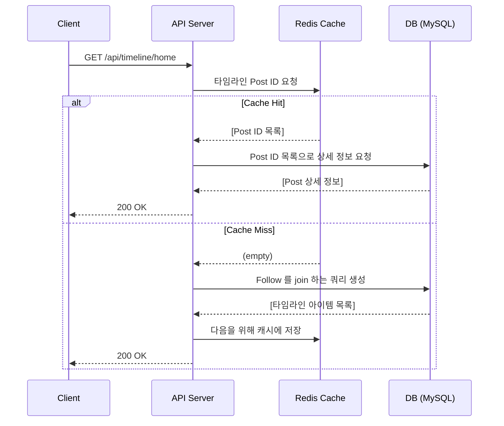
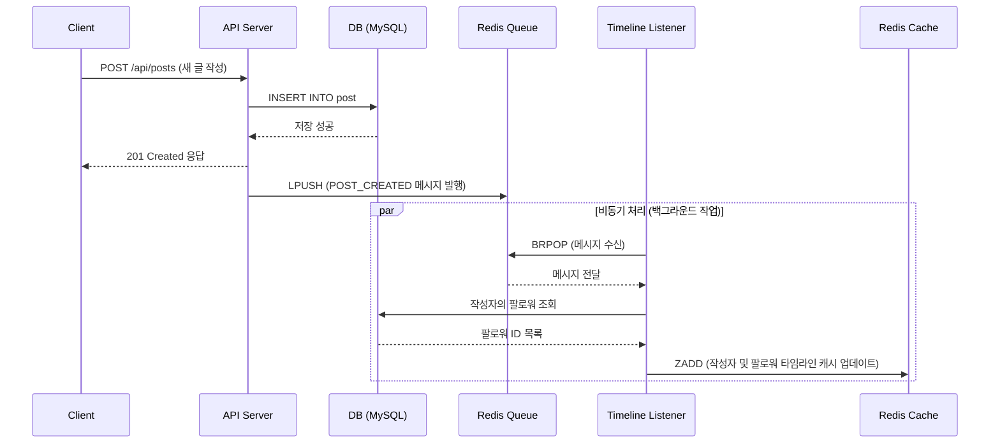
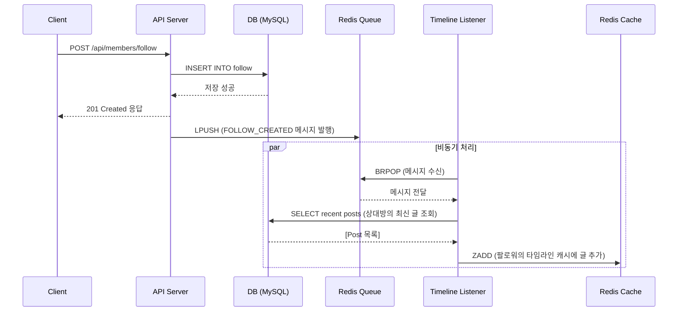
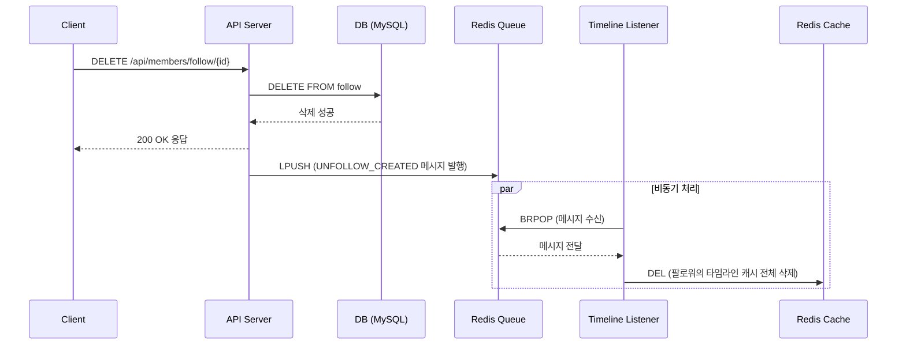
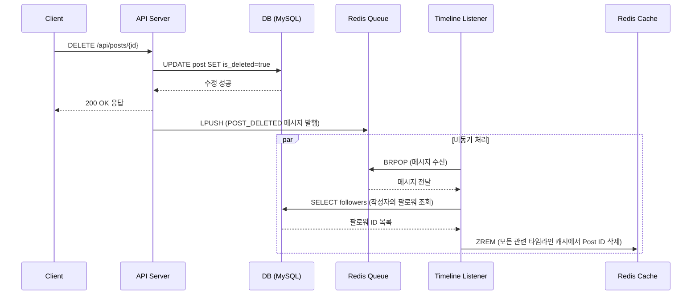

# 🐦 twooter (타임라인 기반 SNS 서비스)

Twitter를 모델로 한 타임라인 기반 SNS 백엔드 API 서비스입니다.

## Table of Contents

- [Key Features](#-key-features)
- [Tech Stack](#-tech-stack)
- [API Documentation](#-api-documentation)
- [ERD](#-erd)
- [Infrastructure](#-infrastructure)
- [Getting Started](#-getting-started)
- [시스템 구성 요소](#-시스템-구성-요소)

## Key Features

- **사용자 및 인증**
    - JWT (Access/Refresh Token) 기반의 회원가입 및 로그인/로그아웃
    - 다른 사용자 팔로우/언팔로우 및 팔로워/팔로잉 목록 조회

- **포스트 및 상호작용**
    - 텍스트 및 미디어를 포함하는 포스트 작성 및 조회
    - 다른 사용자의 포스트를 자신의 타임라인에 공유하는 `리포스트`
    - 포스트 `좋아요` 및 취소
    - 특정 포스트에 대한 응답(멘션)들을 스레드 형태로 조회

- **타임라인 피드**
    - **홈 타임라인**: 내가 작성/리포스트한 글과 내가 팔로우하는 사용자의 글/리포스트를 시간순으로 조회
    - **사용자 타임라인**: 특정 사용자가 작성/리포스트한 글을 시간순으로 조회

- **미디어 처리**
    - `Google Cloud Storage(GCS)`의 `Signed URL`을 활용한 파일 업로드

## Tech Stack

### Backend

- **Framework**: Spring Boot, Spring Security, Spring Data JPA
- **Authentication**: JWT (jjwt)
- **Database**: MySQL, Redis
- **Query**: QueryDSL
- **Migration**: Flyway
- **Documentation**: Spring REST Docs

### Infrastructure & DevOps

- **Cloud**: Google Cloud Platform (GCP)
- **Storage**: Google Cloud Storage (GCS)
- **Database**: GCP Cloud SQL (MySQL)
- **Cache**: Redis
- **Deployment**: Docker, Nginx
- **Server**: GCP VM Instance

## API Documentation

프로젝트의 모든 API 명세는 **Spring REST Docs**를 통해 자동화된 문서로 관리하고 있습니다.

[**➡️ API 문서 확인하기 (twooter.xyz/docs/index.html)**](https://twooter.xyz/docs/index.html)

## ERD


[`dbdiagram.io` 링크](https://dbdiagram.io/d/twooter-67ef99834f7afba18456e665)

## Infrastructure


## ⚙️ Getting Started

로컬 환경에서는 별도의 DB 설정 없이 **내장 H2 데이터베이스**와 **Embedded Redis**를 사용하여 즉시 프로젝트를 실행하고 테스트할 수 있습니다.

```bash
# 1. Repository Clone
$ git clone https://github.com/punchdrunkard/twooter.git

# 2. 프로젝트 디렉토리로 이동
$ cd twooter

# 3. Gradle 빌드
$ ./gradlew build

# 4. 애플리케이션 실행
$ java -jar build/libs/twooter-0.0.1-SNAPSHOT.jar

```

> 실행 후 프로젝트 루트의 `.http` 파일을 사용하여 주요 API들을 바로 테스트해볼 수 있습니다.

## 시스템 구성 요소 


### App Server (Spring Boot)
- API 엔드 포인트
- 이벤트 발행자 (Publisher) : 글 작성, 삭제, 팔로우 등의 상태 변경이 발생하는 경우, 비동기 처리를 위해 Redis Queue에 메시지를 발행한다.
- 백그라운드 리스너 (Consumer) : TimelineQueueListener를 통해 Redis Queue의 메시지를 구독하고, Fan-out 로직을 비동기적으로 수행

### Persistence Layer  
#### Redis (Cache & MQ)
- 타임라인 캐시 (Sorted Set) : 각 사용자 별로 캐시된 타임라인 (게시물 ID의 목록)을 저장, Sorted Set의 자동 정렬 기능을 사용하여 최신순 유지 
- 경량 메시지 큐 (List) : 시간이 오래 걸리는 팬아웃 작업을 API 서버의 주 응답 경로에서 분리하기 위한 Buffer 역할
#### MySQL (RDB)
- 모든 원본 데이터 저장 (데이터의 영속성, 정합성, 안정성을 보장) 

## 주요 동작 Sequence Diagram
### Read Path


### Write Path (Post / Repost)


### Follow Path


### UnFollow Path


### Delete Path 

